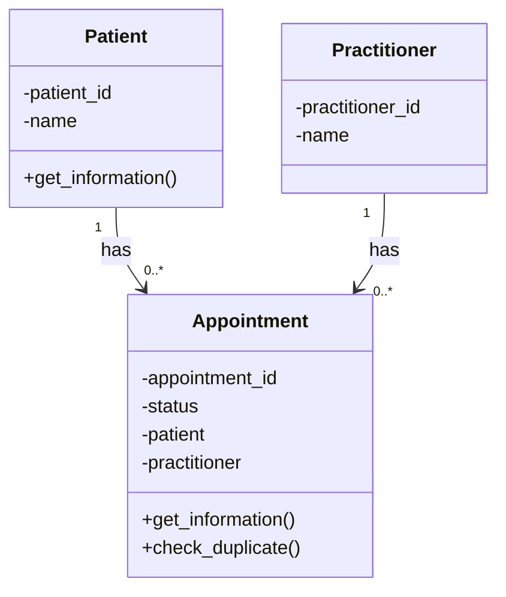

# SmartCare v0.3 Domain Model

## 1. Requirements Review

### Main Nouns

- Patient
- Practitioner
- Appointment
- Appointment status
- Appointment history
- Patient information
- Practitioner information
- Clinic staff

### Main Actions

- Record patient information
- Retrieve patient information
- Record practitioner information
- Record appointments
- Link appointments to patients
- Link appointments to practitioners
- Record appointment status
- View appointment information
- Keep appointment history
- Identify possible duplicate bookings

### Business Rules

- Each appointment must be linked to one patient.
- Each appointment must be linked to one practitioner.
- Each appointment must have a recorded status.
- Appointment history must be kept.
- The system must be able to identify possible duplicate bookings.
- The exact duplicate-booking rules still need to be confirmed with the client.
- The allowed appointment statuses still need to be confirmed with the client.

## 2. Candidate Classes

### Patient

Class. Patient is a main concept in the requirements, and patient information needs to be stored and retrieved.

### Practitioner

Class. Practitioner information needs to be stored, and practitioners are linked to appointments.

### Appointment

Class. An appointment stores appointment information and links a patient with a practitioner.

### Name

Not a class. Name is better represented as an attribute of Patient or Practitioner.

### Status

Not a class. Status can be represented as an attribute of Appointment.

### Appointment History

Not a class at this stage. History can be represented by retaining Appointment objects.

### Clinic Staff

Unconfirmed. Staff use the system, but the current requirements do not require a separate ClinicStaff domain class.

### Database

Not a class. A database is an implementation detail rather than a SmartCare domain concept.

### Cancellation

Not a class at this stage. Cancellation has not been confirmed and could be represented by an appointment status later.

### Clinic

Unconfirmed. The current requirements do not provide enough evidence for a separate Clinic class.

## 3. Requirement and Concept Trace

- FR-01: Patient stores patient information.
- FR-02: Patient provides stored patient information.
- FR-03: Practitioner stores practitioner information.
- FR-04: Appointment stores appointment information.
- FR-05: An appointment is linked to a patient.
- FR-06: An appointment is linked to a practitioner.
- FR-07: Appointment stores its status.
- FR-08: Appointment is responsible for retaining appointment history.
- FR-09: Appointment provides appointment information when required.
- FR-10: Appointment supports checking for possible duplicate bookings.

## 4. CRC Cards

### Patient

Responsibilities:

- Store patient information.
- Provide patient information when required.
- Be linked to appointments.

Collaborator:

- Appointment

### Practitioner

Responsibilities:

- Store practitioner information.
- Be linked to appointments.

Collaborator:

- Appointment

Practitioner does not include a `get_information()` method in the final model because FR-03 requires information to be recorded but does not explicitly require it to be retrieved.

### Appointment

Responsibilities:

- Store appointment information.
- Link an appointment to a patient.
- Link an appointment to a practitioner.
- Store appointment status.
- Provide appointment information when required.
- Support checking for possible duplicate bookings.

Collaborators:

- Patient
- Practitioner

## 5. UML Class Diagram

The diagram shows that each Appointment is linked to one Patient and one Practitioner. A Patient or Practitioner can be linked to zero or more appointments.

The exact data fields required for patients, practitioners, and appointments have not yet been confirmed by the client. The attributes in this model are therefore provisional.

## 6. Design Rationale

The model uses three main classes: Patient, Practitioner, and Appointment. These are the main concepts directly supported by the SmartCare requirements.

Patient represents patient information, and Practitioner represents practitioner information. Appointment represents appointment information and links a Patient with a Practitioner.

Patient and Practitioner are separate classes because they represent different concepts and responsibilities. Appointment does not inherit from either class because an appointment is not a type of patient or practitioner. The classes are connected through associations instead.

The model uses a one-to-many relationship between Patient and Appointment. Each appointment is linked to one patient, while a patient may have several appointments. The same relationship applies to Practitioner and Appointment.

Status is an attribute of Appointment rather than a separate class because the requirements only say that appointment status must be recorded. The allowed status values have not yet been confirmed.

Database, Clinic, and Cancellation were not included as classes because the confirmed requirements do not provide enough evidence for them. Keeping them out of the model avoids adding unsupported functionality.

## 7. AI Design Review

### Suggestion 1: Keep Patient, Practitioner, and Appointment as the main classes

Decision: Accepted.

FR-01 to FR-10 directly support these three concepts, so no change was needed.

### Suggestion 2: Treat the identifiers and names as provisional

Decision: Accepted.

FR-01 to FR-04 do not define the exact information fields. The identifiers and names are reasonable modelling choices, but they must be checked with the client.

### Suggestion 3: Remove Practitioner.get_information()

Decision: Accepted.

FR-03 requires practitioner information to be recorded, but it does not explicitly require retrieval. The method was removed from the final model and Python skeleton.

### Suggestion 4: Represent appointment history without creating another class

Decision: Accepted.

FR-08 requires appointment history to be retained, but it does not require a separate AppointmentHistory class. The responsibility remains with Appointment.

### Suggestion 5: Create a separate AppointmentHistory class

Decision: Rejected.

No confirmed requirement needs this class. Adding it would make the model more complex without clear evidence that it is needed.

## 8. Compare and Decide

The AI review supported the three main classes and their relationships. I accepted this because each class can be traced directly to the functional requirements.

The review also showed that patient_id, practitioner_id, appointment_id, and name are assumptions. These attributes remain in the model as provisional choices because the requirements do not define exactly what information must be stored.

I removed Practitioner.get_information() because practitioner retrieval is not explicitly required by FR-03. This change is reflected in both the diagram and the Python skeleton.

I did not create an AppointmentHistory class. Although FR-08 requires history to be retained, it does not say that history must be represented by a separate class. Keeping the responsibility with Appointment avoids unnecessary complexity.

## 9. Model and Code Consistency Check

The final UML model and the Python skeleton were compared as follows:

- Patient appears in both the model and the code.
- Practitioner appears in both the model and the code.
- Appointment appears in both the model and the code.
- Patient has the provisional attributes `patient_id` and `name` in both.
- Practitioner has the provisional attributes `practitioner_id` and `name` in both.
- Appointment has the provisional attribute `appointment_id` in both.
- Appointment has the `status` attribute in both.
- Appointment stores references to Patient and Practitioner in the code, matching the relationships in the diagram.
- Patient has `get_information()` in both the model and the code.
- Appointment has `get_information()` and `check_duplicate()` in both the model and the code.
- Practitioner does not have `get_information()` in either the final model or the code.

The model and code are consistent. The methods use `pass` because Stage 3 only requires class skeletons. The full behaviour will be implemented later.
